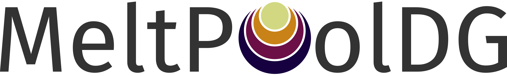

  

:warning: [WIP] This project is work in progress since 2021. We are planning to make the code publicly available in the coming years as part of our broader efforts to share our research openly.
For collaboration requests, please contact magdalena.schreter@tum.de. Impressions will be shared on our [YouTube channel](https://www.youtube.com/channel/UCNZqFRMi-bBMaDMXC38AehA).

## (DG)-FEM-based multi-phase flow solvers for high-fidelity metal additive manufacturing process simulations

The aim of the `MeltPoolDG` project is to provide application-oriented, research-driven solvers for modeling the thermo-hydrodynamics in the vicinity of the melt pool during selective laser melting, including melt pool formation and the interaction of the multi-phase flow system (liquid metal/ambient gas/metal vapor). They are and will be based on continuous and discontinuous finite element methods in an Eulerian setting. For interface modeling of the multi-phase flow problem including phase-transition (evporation/melting), diffuse interface capturing schemes such as level set methods and phase-field methods are used. It strongly builds upon the general purpose finite element library [deal.II](https://github.com/dealii/dealii) and the efficient, matrix-free two-phase flow solver [adaflo](https://github.com/kronbichler/adaflo). Furthermore, via `deal.II` we access also other third-party libraries such as `p4est`, `Trilinos` and `Metis`.

## Authors

The principal developers are (in chronological order of entering the project):
* [Magdalena Schreter-Fleischhacker](https://www.epc.ed.tum.de/sam/team/magdalena-schreter-fleischhacker/) [@mschreter](https://github.com/mschreter), Technical University of Munich
* [Peter Munch](https://peterrum.github.io/) [@peterrum](https://github.com/peterrum), Uppsala University
* [Nils Much](https://www.epc.ed.tum.de/sam/team/nils-much/) [@nmuch](https://github.com/nmuch), Technical University of Munich 

Magdalena Schreter-Fleischhacker has been supported by the Austrian Science Fund (FWF) via a FWF Schrödinger scholarship, FWF project number J-4577. 

Contributors (in alphabetical order):
* Julian Brotz
* Andreas Koch
* Martin Kronbichler
* Judith Pauen
* Johannes Resch
* Tinh Vo

We gratefully acknowledge the contributions and discussions with Christoph Meier (Technical University of Munich), Martin Kronbichler (Ruhr University Bochum), Bruno Blais and Helen Papillone-Laroche (Polytechnique Montréal).  

## Most important publications

* C. Meier, S. L. Fuchs, N. Much, J. Nitzler, R. W. Penny, P. M. Praegla, S. D. Proell, Y. Sun, R. Weissbach,
M. Schreter, et al., Physics-based modeling and predictive simulation of powder bed fusion additive manufac-
turing across length scales, GAMM-Mitteilungen 44 (3) (2021) e202100014. DOI: [10.1002/gamm.202100014](https://doi.org/10.1002/gamm.202100014)
* M. Schreter-Fleischhacker, P. Munch, N. Much, M. Kronbichler, W. Wall, C. Meier, A consistent diffuse-interface
model for two-phase flow problems with rapid evaporation, Advanced Modeling and Simulation in Engineering
Sciences 11 (1) (2024). DOI: [10.1186/s40323-024-00276-0](https://doi.org/10.1186/s40323-024-00276-0)
* N. Much, M. Schreter-Fleischhacker, P. Munch, M. Kronbichler, C. Meier, W. A. Wall, Improved accuracy of
continuum surface flux models for metal additive manufacturing melt pool simulations, Advanced Modeling and
Simulation in Engineering Sciences 11 (16) (2024) 1–40. DOI: [10.1186/s40323-024-00270-6](https://doi.org/10.1186/s40323-024-00270-6)
