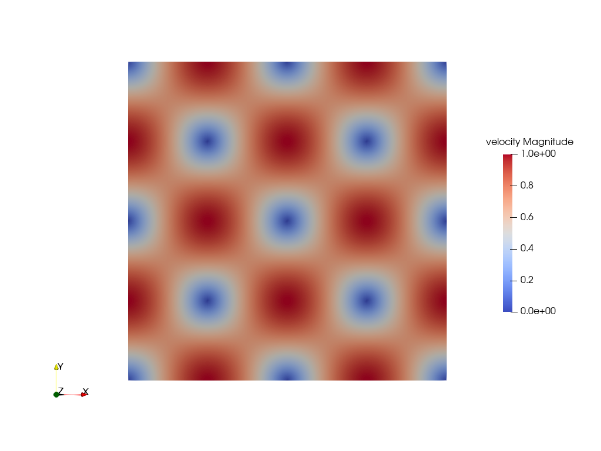
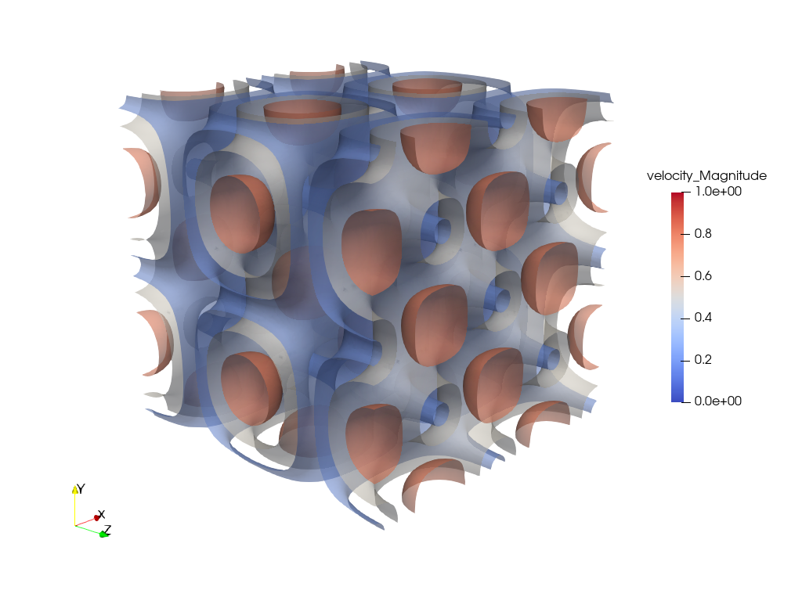
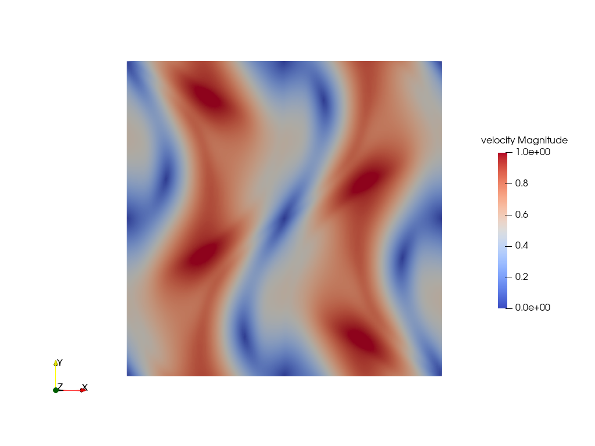
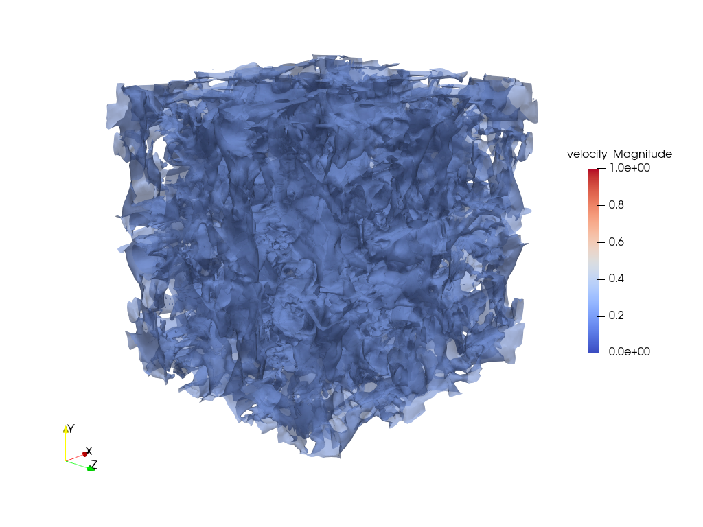

# Taylor-Green Vortex

The Taylor-Green vortex is a canonical benchmark problem, which has an exact closed form solution of the incompressible Navier-Stokes equations in Cartesian coordinates. It describes an unsteady, single-phase flow consisting of a periodic array of counter-rotating vortices that decay over time [^1].

## Features

- `mp-melt-pool` with periodic boundary conditions

## Problem Description

 The setup of this case follows the Taylor-Green vortex example provided in the Lethe documentation [^2].\
 It is implemented for both two-dimensional and three-dimensional simulations.
 The Taylor-Green vortex is simulated at a Reynolds number of $Re = 1600$ in the domain

 $$\Omega = [-\pi,\pi] \times [-\pi,\pi]$$

 for the 2D case and

 $$\Omega = [-\pi,\pi] \times [-\pi,\pi] \times [-\pi,\pi]$$

 for the 3D case. Periodic boundary conditions are applied in all coordinate directions.

 ### Initial Conditions

 For the 2D case the initial velocity field $[u_x, u_y]^T$ is specified by:

 $$u_x = \sin(x)\cos(y)$$
 $$u_y = -\cos(x)\sin(y)$$

 For the 3D case the initial velocity field $[u_x, u_y, u_z]^T$ is specified by:

 $$u_x = \sin(x)\cos(y)\cos(z)$$
 $$u_y = -\cos(x)\sin(y)\cos(z)$$
 $$u_z = 0$$

 The pressure field is not explicitly prescribed as an initial condition. In incompressible flow, the pressure acts as a Lagrange Multiplier to enforce the divergence-free constraint of the velocity field: $\nabla \cdot \mathbf{u} = 0$.

 Since the Taylor-Green vortex is a single-phase flow, the level-set is initialized to the constant value of -1.

 

  
  

  <em>Figure 1: Initial velocity fields for the 2D (left) and 3D (right) Taylor-Green vortex.</em>

 ### Material Parameters

 The simulations are performed at a Reynolds number of $Re = 1600$. The material properties are chosen as follows:

 - `density`: 1.0
 - `dynamic viscosity`: 0.000625

## Simulation Results

 The results for the 2D and 3D simulations are shown below in Figure 2.
 For both cases, the evolution of the velocity field over time is displayed.
 In 2D, the initial vortex structures slowly decay over time as kinetic energy is dissipated, causing the flow to come to rest.
 In 3D, the same decay of the initial vortex structures can be observed. However, the flow pattern generated by the Taylor-Green vortex becomes increasingly complex over time. The initially two-dimensional vortex structures break down and develop smaller three-dimensional structures.

 

  
  

  <em>Figure 2: Evolution of the velocity fields for the 2D (left) and 3D (right) Taylor-Green vortex over time.</em>

## Post-Processing

 For post-processing, the calculation of the H1-seminorm of the velocity field is available. It is defined as:

 $$|\mathbf{u}|_{H^1(\Omega)} = \left(\int_{\Omega} \|\nabla\mathbf{u}\|_{L^2}^2\\mathrm{d}\Omega\right)^{1/2}$$

 The H1-seminorm provides a measure of the spatial variations of the velocity field and can therefore be used as an indicator of spurious oscillations in the numerical solution.

## References

[^1]: “Taylor–Green vortex.” Wikipedia. Aug. 26, 2026. Available: https://en.wikipedia.org/wiki/Taylor%E2%80%93Green_vortex.
[^2]: “Taylor–Green vortex.” Lethe documentation. Aug. 26, 2026. Available: https://chaos-polymtl.github.io/lethe/documentation/examples/incompressible-flow/3d-taylor-green-vortex/3d-taylor-green-vortex.html
